|      Title      | ****Anvay Custom Keeb****                                                             |
|:---------------:|:--------------------------------------------------------------------------------------|
|   **Author**    | Anvay Mathur                                                                          |
| **Description** | A 100% layout custom keyboard with **104 keys** and **1 rotary encoder volume knob**. |
| **created_at**  | 2026-08-11                                                                            |

### Total time spent on this project: 45 hours  

----------------------------------------------------------

# Day 1 - Planning the keyboard - 1 hour - Aug 11th, 2026
* First I created the repo today! First step towards my first mechanical keyboard.

* Started planning of keyboard layout in Keyboard Layout Editor NG  
  
  * I want to do LEDs under each key and an OLED screen where the insert, home, PgUp, etc. keys are. 
  I am choosing that spot because I don't really use those keys much and some of them can be mapped to other places 
  I am considering adding smaller sized buttons underneath the OLED screen to either control the screen or just to have a few extra buttons.
  
  * I also want a rotary encoder module for my volume knob as that is something I find really cool
  
  * I also want individual LEDs that tell if caps lock is on and if num lock is on.
  
  * I took about an hour to research other 100% layout keyboards and look for inspiration, although my board isn't that unique. 
  I was looking for extra features to add such as custom buttons or changes in layout, 
  but I really liked the basic 100% layout of this [amazon listing](https://www.amazon.ca/dp/B09JG81YRT/ref=twister_B0CQ64LNPY?_encoding=UTF8&th=1) 
  and used that as a sort of example to go upon. It didn't have anything unique, but I found the basic layout to work really well, 
  and I made my own changes with the knob and the OLED screen. I temporarily added the buttons, but I don't know if I am going to keep them.
  I ended up with [this](https://editor.keyboard-tools.xyz/#share=NobwRAhgrgLgFgewE5gFxgIIDsBuECeABALITxQoA0YARhAMYDW9CANsmmAMQBmf-fMNSwQAtgFNOABQQxxWGAEsIrQgGlx+GgghIAJoQAyBBLDABfSsDABRAM70h4AB5oAjJbAAxN0O8AmPy8AZiCAFicwV1QABgA6AFZPLwSggDYggHYggA5I6Pik6i8ATiC3GPLfYrdAyhc0eP8isCkkGABlR2oupDZVQwQmPyloO3EAHSwAISRxCEYwAF0rcHxGxM8APymAAz8AQinqsAABKbruKdDqABIpiOoAUinU6gA9KYzqADIp7OoACopnlqAAKKZlagASimlWoAH0pgBaPwAaimAF5IgB3ND+TzTBiMOwABwYknqUTQwU21AAclBREYhotqAB6PyAvyolagMB41BuOlgAAqEBofgAin4AOp+Gx+ABKflFfgAmn4AKp+ACSfgA8iM-CAptZqOYpktce4RQAfKYTCb5GkizJTAASCAkfhyU0AiYR+EpTKQAcy1pMicHxnjRy1WAttmRaAGEIKS7CzhtQMH4On4ACJBPwAcT8Hr8ACk-Go-IY-KgpgBuPzOqYAchtqH8cWanhsCnEVAaqFpLTCU0ACYR+N5gNJTQBJhPH+YKe32enBFDwYH4AFp+AAafhTfgAan5pn56X5iH4ADxTajUAB8UzifgA-FNOVTV3Fk54HSbtuLpCr2LSBlS0TCuuYBuFMA56H4-hTIAyYR+MEIahgWWBRjG1ADnIKB8uAgowamMBIKwXbkZ4sqKLhv62rBGCsDuVIQI01CCmk4GeJEnGoGE3HMS0rHsaRol0QxNF8dQxDyFAsmwSmlHUVBGywdO1DodQS4abE4Eid2ngxFMupYHYfhxFMBbiNRJHUkKCT-gk1DrKgyJuYmJnUAahg2AWhAdCmSo2DY16OdBLnJu5mneYJMTGYU1DRoZLSgU03mCilYBpYU-EGVlyWJKlGwZVF7glHFnljiV3n5SKmVGT5uWNRVCbRP4bg1ci5HUIJwk+bR1CnmwTLiIQBbKA5SxAA) 
  design in Keyboard Layout Editor NG

 # Day 2 - Creating a prototype in Onshape - 5 hours - Aug 12th, 2026
Today I started with creating a low fidelity prototype in Onshape to give me a better idea of what goes into building a custom keyboard, especially the case.
I did a lot of research into the different type of mounting styles, [this](https://www.monsgeek.com/blog/comprehensive-guide-to-keyboard-mounting-styles/) 
document was extremely helpful, and after about 1 hour I settled on a top mounted keyboard. I want this type of mount because it is simple to design but has a consistent feel regardless of key position and has a stiffer typing feel.  

I started the design in Onshape, but I have never really researched or seen a lot about keyboards before so I took some time to watch some videos on how different keyboard mounts work and how they are designed. 
I specifically focused on Top Mounted keyboards because that is what I wanted to build. I used Gemini to guide me through the creation of the prototype whenever I was stuck on a certain part or didn't understand the concept.

I also did some research into certain decisions like which microcontroller to use. I decided on using the Raspberry Pi Pico because it is a small form factor mc but has a lot of pins, which is something I think I will need, but this is subject to change.

#### Working on the prototype itself:

* I have never really used Onshape before, I have however used fusion a decent bit so it didn't really take me long to learn it.
* I started by creating a variable studio that holds basic variables such as 1u length, what my bezel length is going to be, etc.
* I then moved on to creating basic placeholders for the electronics, because I made this prototype to mostly figure out electronics placement, especially the pico.
  * I decided to place the pico on the underside of the PCB in the top left corner, with the usb-c port facing out the back. So close to where the esc key is.
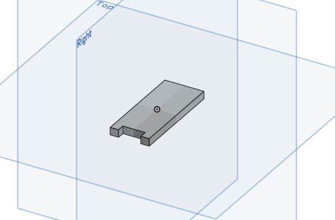
* Next I worked on creating the switch plate. This was something new I learned because I did not know keyboards needed this. I always thought that the keycaps and the switches were attached to the case itself.
This took me more time than I would like to admit because I had no idea what I was doing. It was quite a struggle to figure out how to create this easily. I ended up making it just a square grid instead of doing the thing where the columns aren't perfectly aligned with each other because I couldn't figure it out. 
I also learned that it is much easier to make this when I have a PCB built, at least I hope it is easier.
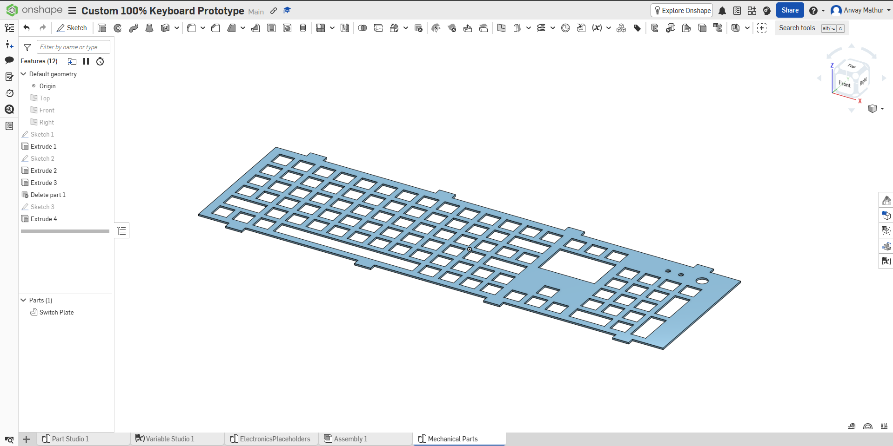
* I then worked on the case. In the interest of time and feasibility I decided to just design it like a sandwich mount, so the tabs I built are visible from outside the case. In the actual build I will make sure to have that lip, like the image shows from that document.
I just made the case 1 bottom rectangle which is hollow, and one top rectangle which only has the walls. I didn't really make mounting holes or anything like that as I thought it was unnecessary for the purpose of this prototype.
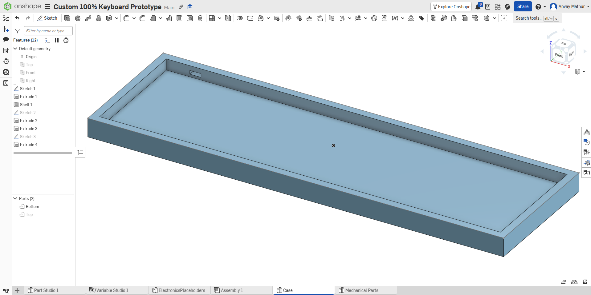
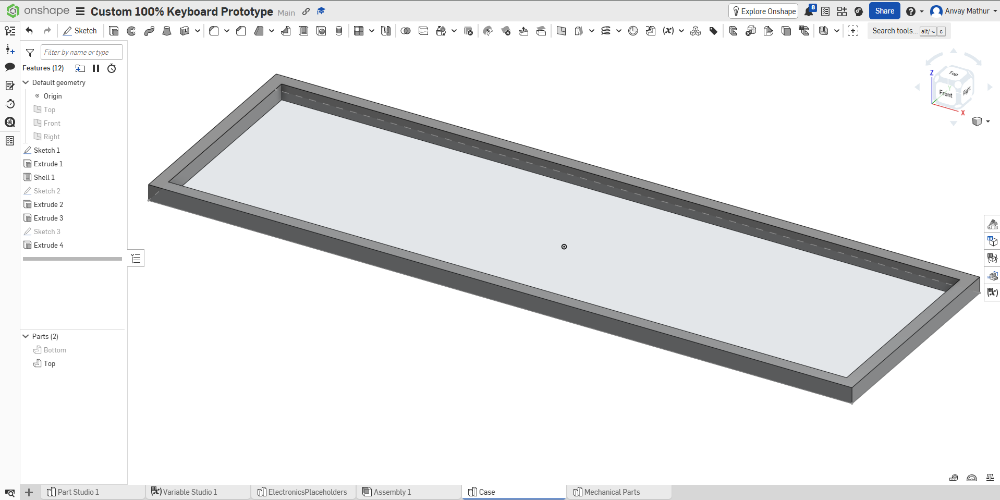
* This is what my case prototype looks like:
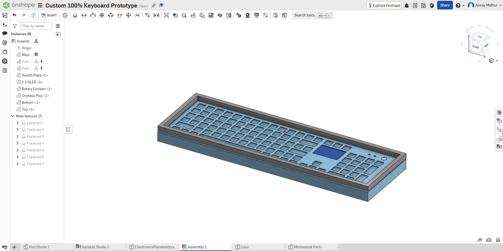

# Day 3 - Started on Schematic - 2 hours - Aug 13th, 2026
* I have never made a custom PCB or schematic before, nor have I worked in KiCad at all, so I don't really know what's going on.
* I learnt what a keyboard matrix is, and watched some videos on how that works and why it's needed. I guess I didn't really need the pico because I can just do this matrix thing, but I'm gonna keep it anyway.
* I downloaded KiCad like the guide says and set up the [marbastlib](https://github.com/ebastler/marbastlib) library, but I didn't do anything else in the schematic itself, just a lot of research and videos.

# Day 4 - Schematic - 6 hours - Aug 14th, 2026
* I finally started on the actual schematic. It actually turned out to be much simpler than I initially expected. I always thought custom
PCBs were really hard to make and needed a lot of knowledge on electronics, but it's not that hard.
* I initially made the schematic look like it would on the keyboard itself, but that didn't really work out cause I didn't have pins for 6 rows + 22 cols.
I learnt from Gemini about something called matrix folding, where it doesn't matter what the schematic looks like, just make a grid that fits the amount of pins available. Ps, I'm glad I picked the pico with its 28 pins.
* It took me a while to wrap my head around the fact that the schematic doesn't actually have to look like the keyboard. I was thinking that the schematic wiring would be how the wiring looks like on the actual PCB. 
I found out that later when I start on the actual PCB I have to redo the wiring however I want, as long as 2 things are connected on the schematic they need to be connected on the PCB.
It took me like 3 restarts to figure out the right sizing of the matrix because I was trying some very goofy stuff to get the wiring to fit the pins instead of just creating more rows. 
I had to really condense the pins the matrix uses a lot because I needed 2 pins for the rotary encoder, 2 for the OLED and 1 for the LEDs which means I only had 21 pins for the matrix.
* This is what my schematic looks like right now:
* 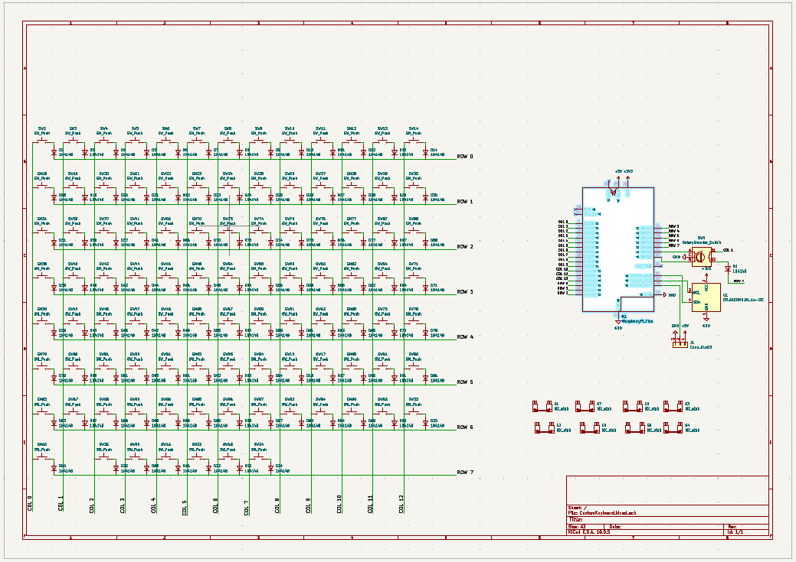
* The wiring of the OLED was pretty easy and same for the rotary encoder. I put an extra switch in the schematic where I want the rotary encoder to go for the push-down effect of the encoder.
* For the LED I found out It's pretty hard to have LEDs for each switch, so I decided on just having a rgb LED strip that runs underneath the whole thing to act as like an underglow effect. 
I will just have to design the case to have something for that. For that in the wiring I asked Gemini, and it said just put a generic 3 pin connector to signify the LED strip.
* This is a zoom in of the OLED, LED strip connector and rotary encoder wiring:
* 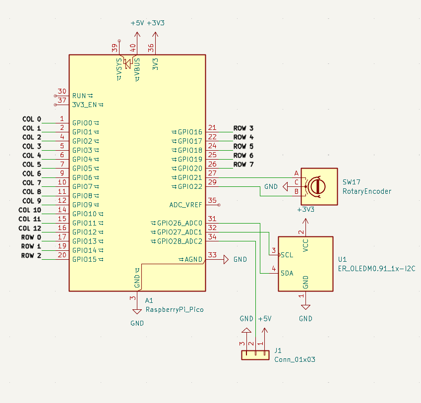

# Day 5 - PCB and Panic - 8 hours - Aug 17th, 2026 (written on the 18th morning)
* I started work on the PCB itself. I learned that each component needs a footprint that decides how the holes and stuff look.
I also found out that I did not import the marbastlib library properly so it took me a while to find the footprints for the switches because I had to go back to the content plugin manager and click install on the library. 
I then also found out while looking through the options for switches that it is possible for a custom keyboard to have hot swappable switches really easily so I decided cause I didn't have to change much I will go with that.
The main thing that affected was the placement of the pico cause now all the switches/sockets are on the bottom I can't put the pico underneath the board where a switch is, so I decided to put it in the top right corner and get rid of the 2 LEDs for caps lock and num lock. 
Mostly because I kinda forgot I wanted those in the first place, and they weren't really that important to me. So I worked on placing each switch/socket and diode in the right spot for a while, the diodes especially were really annoying.
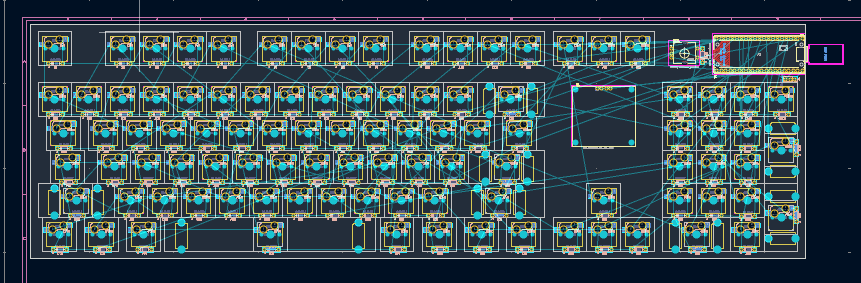

* Then, when I went to do the routing I was talking to a friend who introduced this to me and I sent him a screenshot of the routing, and he said that's not what It's supposed to look like.
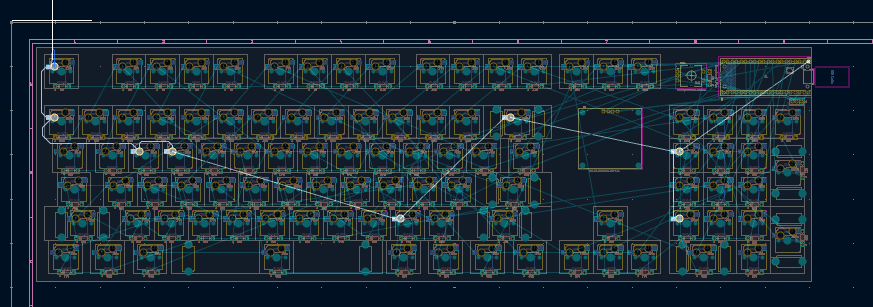
* As you see in the image, that is supposed to be the routing for 1 column. He said that is way too complex for my first build. He also told me about the deadline of 31st august. 
This deadline especially shocked me because I am leaving for vacation on the 22nd and won't be back until September so that means I need to finish this by the 21st.
This led me to make the decision to scrap the OLED screen, scrap the LEDs and restart the whole schematic and PCB process at 12 am.
* This led to a work session till 4 am. One big decision I made while working was that I didn't want to mess with matrix folding as much as possible.
* So I did a lot of testing of different key orientations to reduce the matrix folding as much as possible and fit the keys within 6 rows, and just move around the columns.
Since I decided to bring back the 6 keys that I had originally decided to remove for the OLED. Here are some of the combinations I tried but didn't work out:
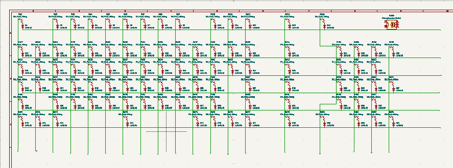  
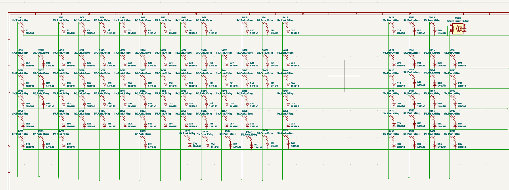
* So after doing a lot of research to find a microcontroller with more pins that's small enough to fit in that space. With the help of Gemini, I ended up deciding to just have an I/O Expander.
This gave me 16 more pins and allowed me to not do matrix folding. I still moved the columns around a little to get rid of one column because it felt weird to me to have a column that only has 1 key.
This led me to have this final schematic:
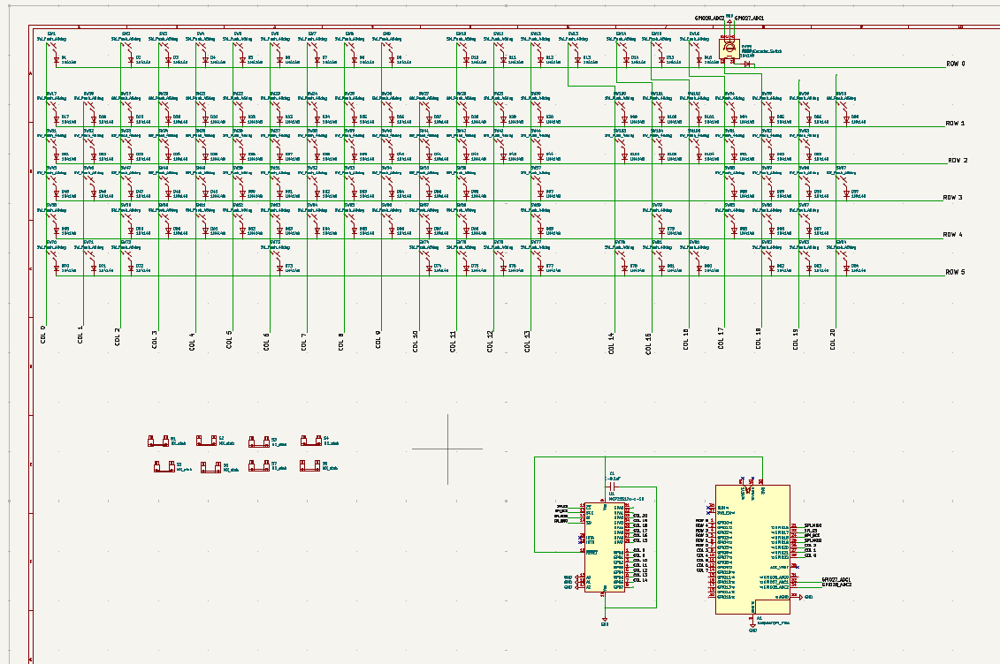
* I decided to use the MCP23S17 I/O expander, upon Gemini's recommendation and some personal research.
I decided to use the version that communicates over SPI because its better built for keyboards and reduces the input delay.
I aso needed a 1uF capacitor for this IO expander.
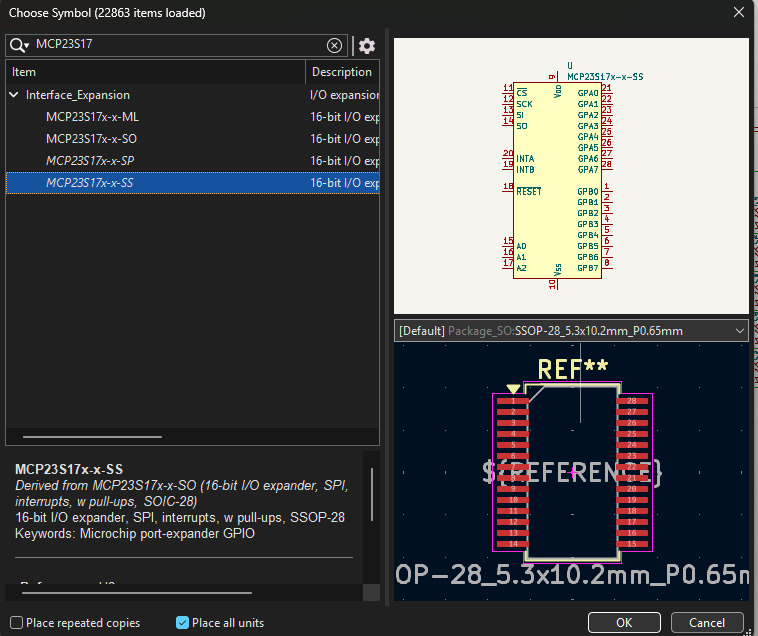
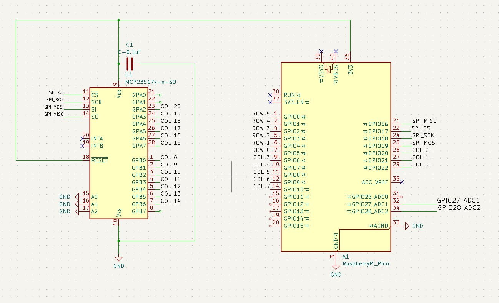
* Because I had already done the schematic before, I could do the schematics much quicker so overall the process only took me 2 hours.
* I then spent the next 2 hours placing the switches/sockets and diodes in the correct spots. I also started routing all the diodes to the correct pad within the switch itself.
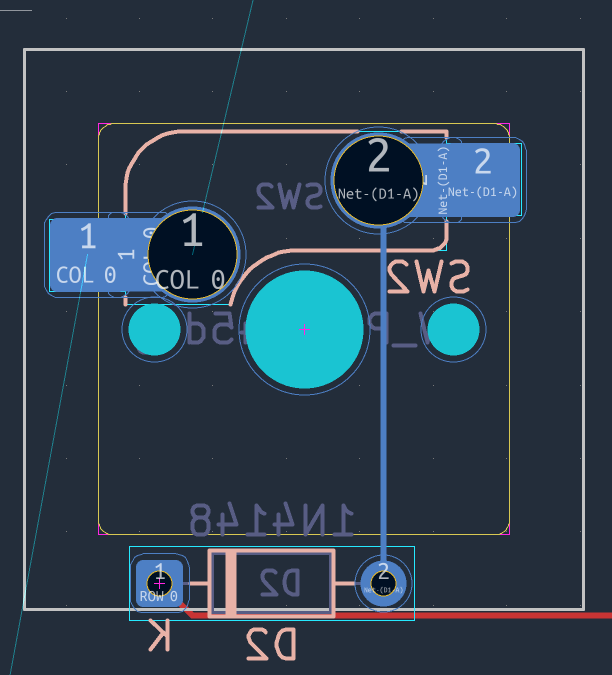
* I then went to sleep cause I was tired

# Day 6 - PCB Finished - 8 hours - Aug 18th, 2026 (written on the 19th morning)
* Yet another 4 am work session :(
* After doing all the diodes the night before, I started with the wiring of the I/O expander to the Pico.
* I started doing the wiring for the columns, which was much simpler this time. While doing that I realized KiCad allowed me to connect to both the hole of the socket and the actual pad.
I asked Gemini which one to connect to, and it said connect to the pad, cause it won't work if I connect to the hole. This shocked me because I had done the wiring for all the diodes to the hole of the switch, as you can see in the image above.
I then had to go back and change all the 104 diodes wiring to connect to the pad instead. 
* And against the advice of the guide, due to a lack of reading, I started with connecting all the switches to each other first. Instead of starting from the pico/expander.
* After connecting all the rows to the correct switches, but not connecting them to the pico or the expander, I started on the rows. I did the rows on the top layer and the columns on the bottom layer.
For the rows, it was really straight forward and easy to do because of the lack of matrix folding. I finished the rows completely, connecting them all to the pico. I had to adjust which row goes to which pin to make the routing easier. 
* Because I started with connecting the columns to each switch first, it made it much harder to connect to the pico and expander. Because I put all the columns and rows on the pico and expander without putting too much thought when doing the schematic, 
I realised it's easier to route some cols to the pico instead of the expander.
So I had to go back and change the schematic to make the routing cleaner. 
I also had to use quite a few vias around the connection of the expander to the pico.
After a lot of adjusting to make the wiring neater, I ended up with a not so bad product.
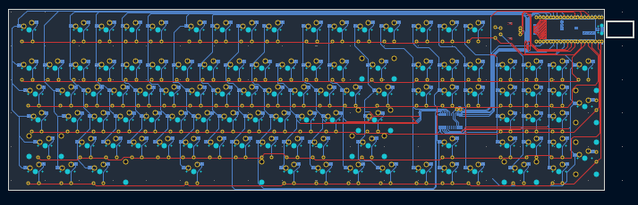
* I then ran the design rules checker and I had a few traces connected to nothing and a few traces not connected to each other which were simple fixes.
* I also had a warning of some silkscreen being hidden by a hole for the stabilizers but my friend said I can ignore it.
* I then moved on to adding the copper fill, initially I wanted a hatched pattern because I thought it looked cool.
* However, it was causing a lot of issues with the design rules checker, especially around the capacitor for the I/O expander.
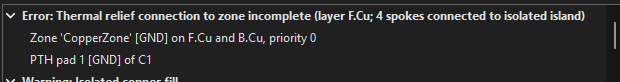

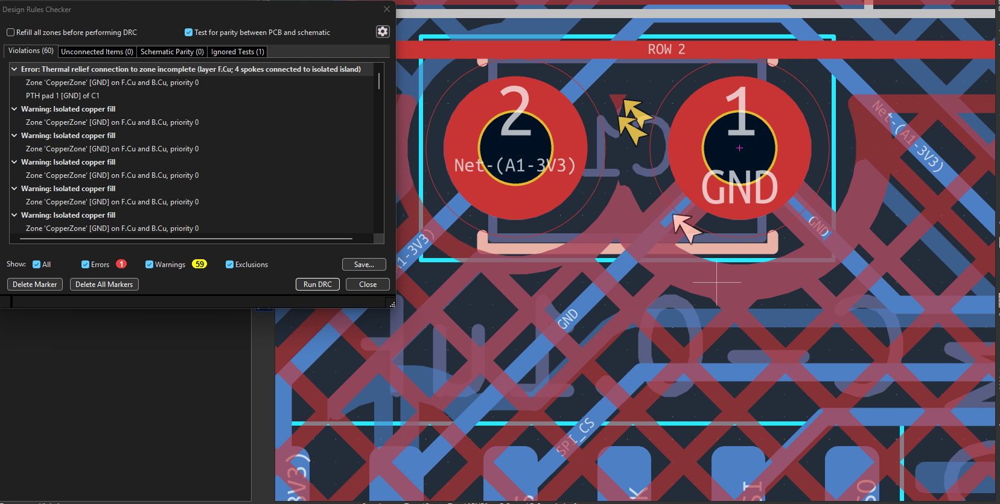
* So I decided to go with a solid fill and connect it to ground. I then added some drawings and quotes on the silkscreen layer for fun.
* This was the finished product:
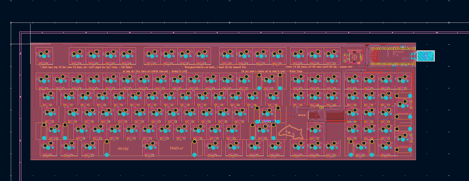
* The Copper layers only:
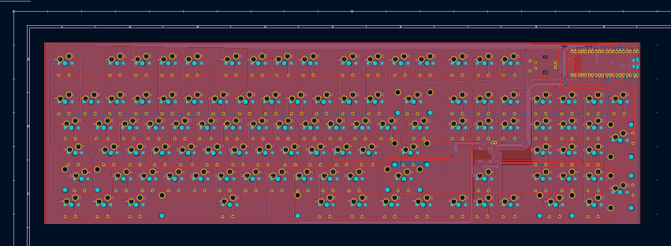
* The 3D view in KiCad:
  * Top:
  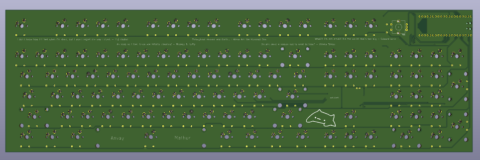
  * Bottom:
  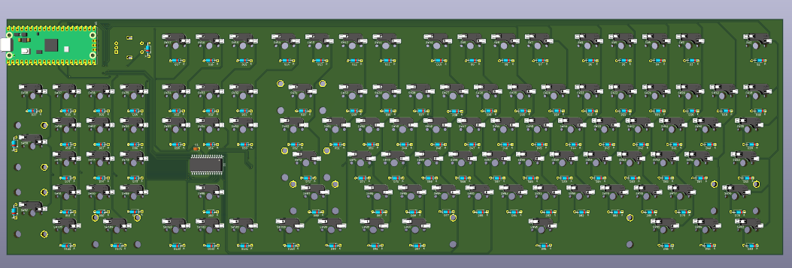
* In hindsight, I forgot to add a 3d model for the rotary encoder, but it's probably ok.
* I also exported the Gerber and drill files and commited everything as a zip to the GitHub repo. (P.S the commit says Aug 19th because I commited at 4:30 am, but I am counting that as the 18th)
* And then I went to sleep cause it was 4:30 am again.

# Day 7 - CAD - 12 hours - Aug 19th, 2026 (written on the 20th morning)
* Yet another 2am work session :(
* I started the cad in Onshape by importing the pcb in as a step file. It imported each component as its own part studio which is pretty cool, I didn't know it did that.
  I started with importing just one model of a switch and one model of a keycap from grab cad and assembling that onto the pcb. I didn't do that in KiCad because I was unsure if I was supposed to.
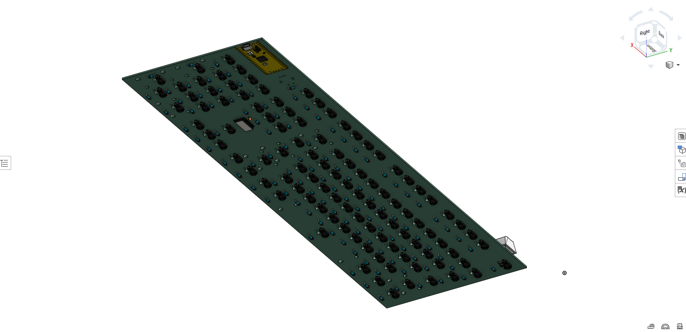
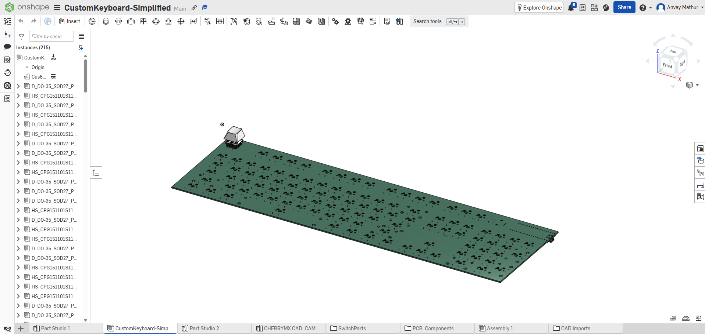
* I then started with making the bottom of the case, just a simple rectangle with a hollow spot for the pcb and the plate to sit. Very similar to the prototype
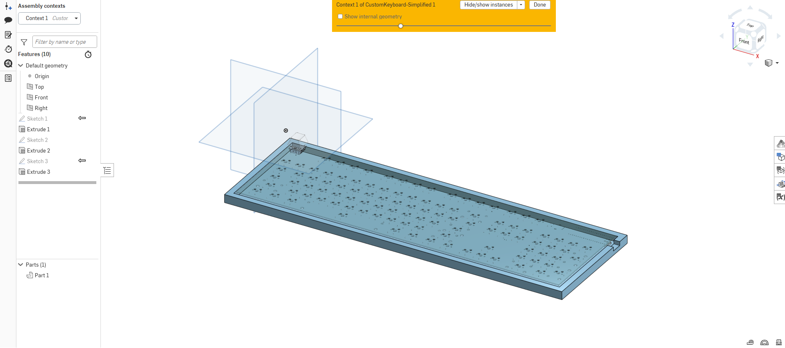
* I then moved on to making the plate in a new part studio, but this time it was actually made proper. It used the pcb assembly as a reference in the part studio.
Then made the 14x14 squares around 1 of the keys in each row then used the linear pattern tool as much as I could. 
* It took me a while to get the stabilizers done because those were more complex and I never knew how they worked, so I had to do a little research there.
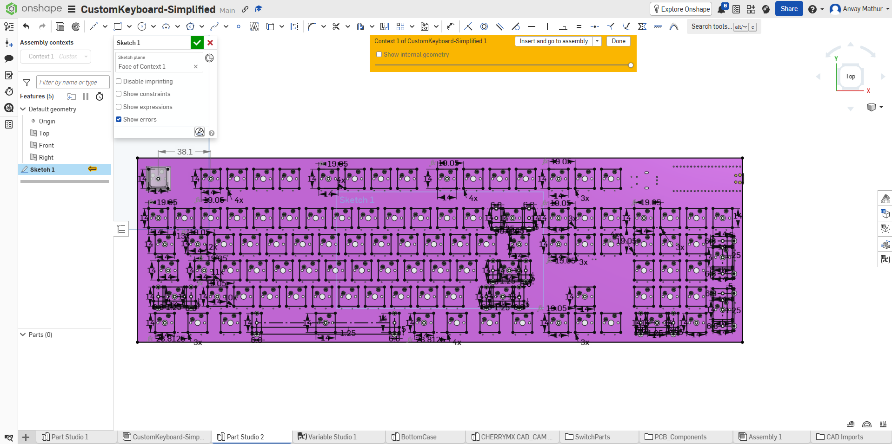
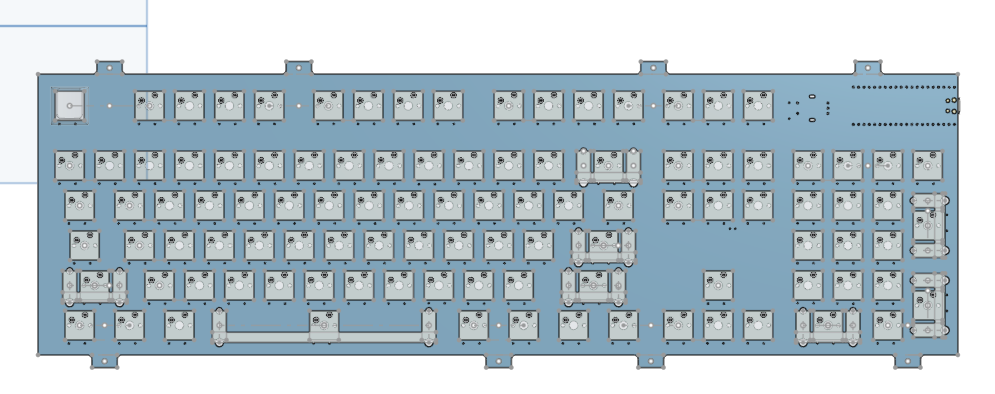
* Then in the same part studio I started building the top of the case. I did it in the same part studio so I can use the reference of the plate.
For making the top, I started with a big block then hollowed it out, making the bezel. Then to achieve the Top mount part I made an inner lip
for the pcb and plate to sit in, along with the places for the plate's tabs to screw into. I decided to use brass heat-set inserts so I can take the case apart without stripping the plastic since its 3D printed.
I also added the mounting holes for the plate and the bottom case. And a hole for the usb-c port. 
Surprisingly enough the pcb sits high enough that the entire space for the usb-c port is just on the top case. 
I was thinking based on the prototype it would be all bottom case or split in between the top and bottom.
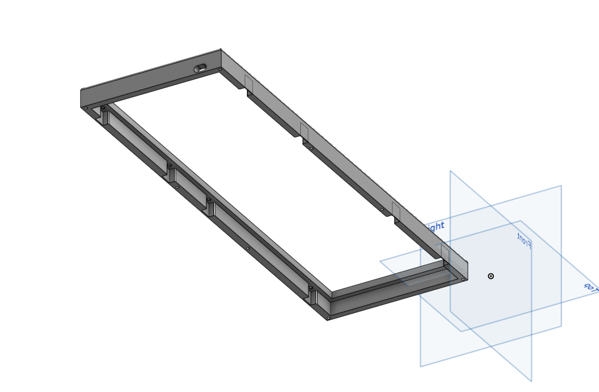
* 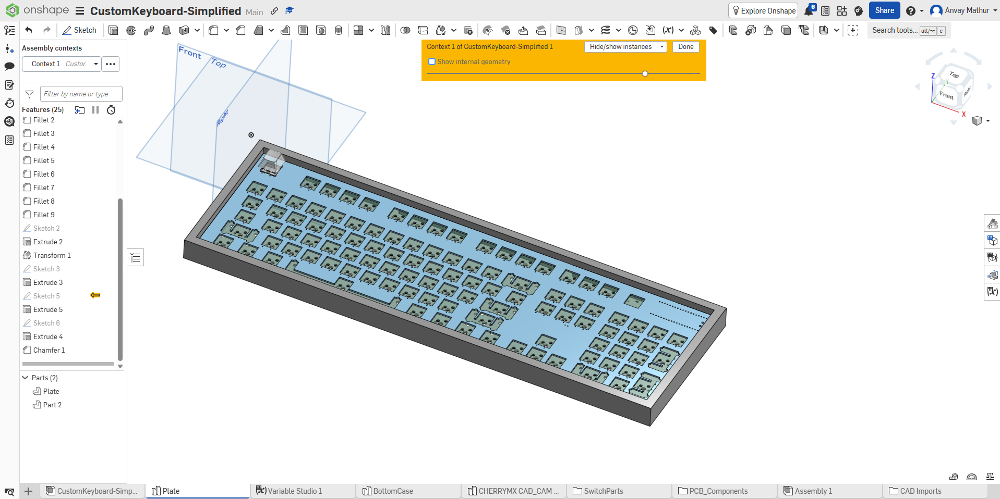
* I then realised it's easier to make the bottom case with the context of the top case and plate, so I remade the bottom case.
This time it was better because I could use the context of the top case and plate. 
The bottom case was pretty thin because the top case itself had the needed space for the pcb to sit along with the extra room just in case. 
* I wanted an angle to my case, so I added a wedge which angles it 6 degrees, which is what Gemini said the average tilt on a mechanical keyboard is. 
* I also added the necessary mounting holes.
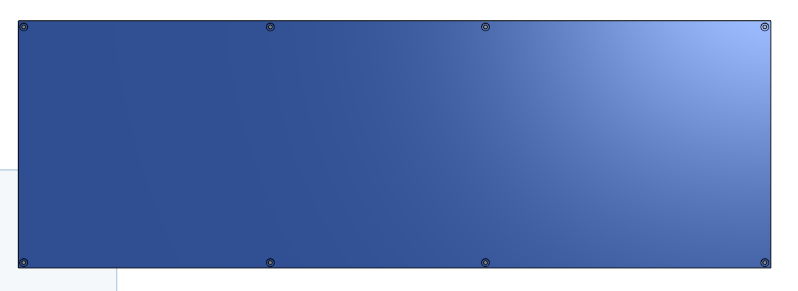
* Finished case:
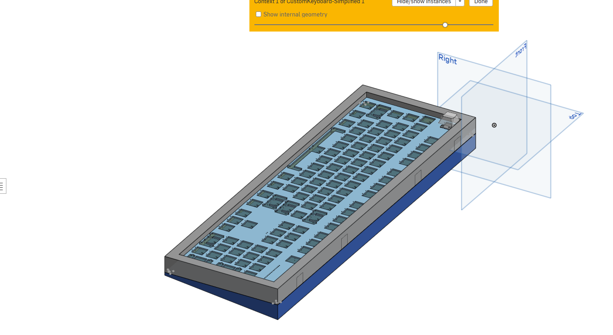
* I did not split it yet, not sure if I need to do that before or after submitting because I am in a time crunch, and it was 2am.

# Day 8 - Firmware & BOM - 9 hours - Aug 20th, 2026 (written on the 21st morning)
* Another 4am work session :(

#### Firmware:
* I decided to use QMK because it's supposed to be much faster when interacting with I/O expanders and I don't really need wireless capability for my keyboard.
* I initially wanted to have it so all the firmware lives in my own repo, but after messing around for 2 hours I learned the hard way that QMK doesn't allow that.
So I decided to fork the qmk repo and write my software there and add a submodule to that repo in this repo. This made it much faster.
* For the code itself, I had to write my own matrix scanning algorithm because QMK does not natively have that for an I/O expander that uses SPI communication.
* I used Gemini to assist with the code as I have never used C before nor have I worked with QMK or any keyboard firmware libraries.

#### BOM:
* Around 10:30 after finishing the firmware I decided to work on the BOM. I have never used AliExpress in my life before but my friend helped me find cheaper options.
* When looking at the prices I had a dilemma, the prices I am seeing are the on sale prices but the sale ends on the 26th and I am going on vacation tomorrow so I won't be able to order before the sale ends.
So should I put the sale prices or the original price? I can't put the original price because those are always inflated before the sale to make the discount look bigger.
I decided to put the sale prices but for some components I picked slightly (like by around 1-5 dollars) more expensive sale prices to account for the fact I will be ordering at full price.
* I used ChatGPT and Gemini to advise me on what to buy and what not to buy as I haven't really used aliexpress before and I don't really trust it much.
* The total came to $203.36 which was much higher than I expected, but I hope its low enough to get the grant.
* I made the whole thing in Google Sheets and then exported it as a csv file. Here is the link to the original BOM: https://docs.google.com/spreadsheets/d/1LunAD5pZXqozTI3veBID0ZXqFftMwYiq4rUHlNX5dX8/edit?usp=sharing
* The csv does not include the extra notes as that was not fitting in the csv structure and could have been misleading.