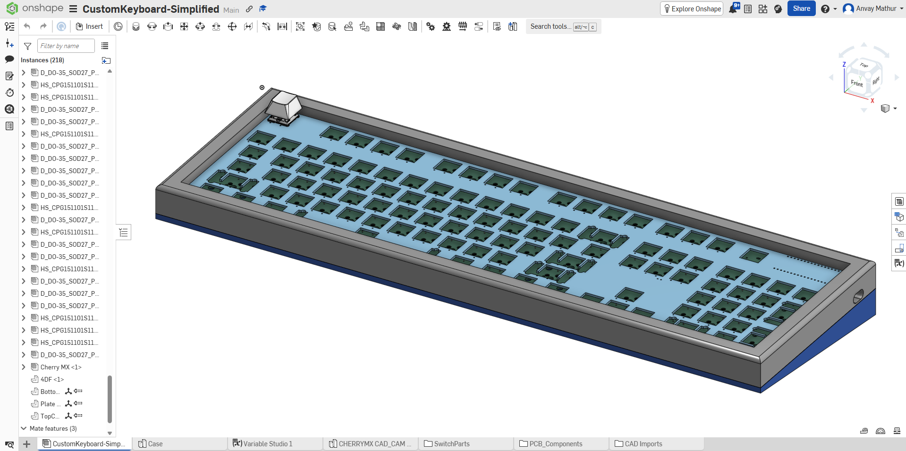

# Atlas

Atlas is a custom 100% layout keyboard with **104 keys** and **1 rotary encoder volume knob**. It uses QMK firmware and was
built to learn more about custom PCB building and learn tools like KiCad as well as learn and practice soldering.

I built this project to participate in [Hack Club's Keeb YSWS](https://keeb.hackclub.com/) and used the guide to build this project.

## Features
________________________________
* 3D Printed Case
* EC11 Rotary Encoder for volume control, press down to mute/unmute you're mic.
* 104 Akko V3 Pro Cream Blue 5 pin Switches 
* Uses an I/O expander
* Custom PCB
* 6-degree angle to make typing easier
* USB-C Wired Connection

## CAD Model
_______________________________
Built to be assembled using 16 M2 screws and brass heat-set inserts. 3 separate parts, the plate for the switches, 
the bottom frame, and the top frame.

## PCB
_______________________________________
Custom PCB Made in KiCad. Some footprints and schematics were from [marbastlib](https://github.com/ebastler/marbastlib). 

## Firmware
______________________________________
This keyboard uses QMK Firmware (written in C). It has a custom matrix scanning algorithm to use an I/O expander which communicates over SPI protocol.
* Rotary encoder changes volume
* Rotary encoder push button mutes/unmutes mic.

# Bill of Materials (BOM)
____________________________________________
Here is everything that you will need to make the keyboard: [Click here](https://docs.google.com/spreadsheets/d/1LunAD5pZXqozTI3veBID0ZXqFftMwYiq4rUHlNX5dX8/edit?usp=sharing)

# Thank you and Credits
Thank you for reading this. I would like to credit @aahan-1105 for helping me throughout this process and for introducing me to this project.